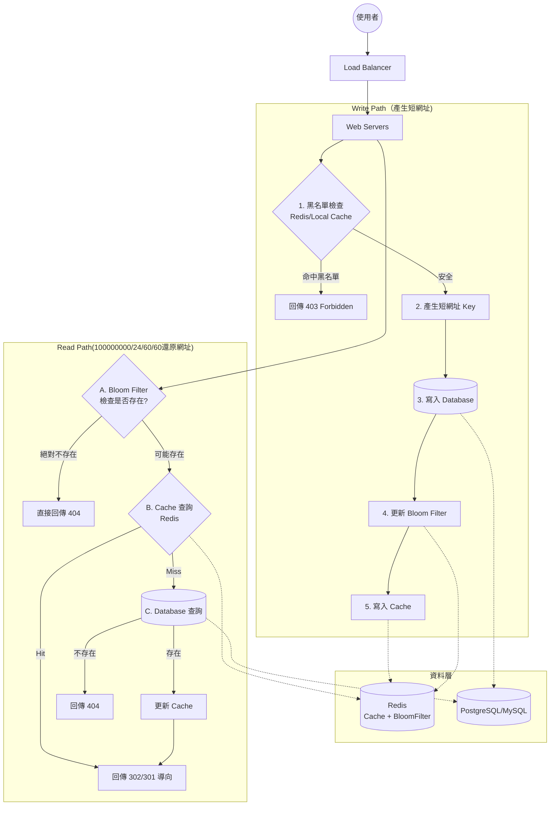

# 1. Design

> [!Note]
> - folder structure follow [google/exposure-notifications-server](https://github.com/google/exposure-notifications-server)
> - [The standard library now has all you need for advanced routing in Go](https://www.youtube.com/watch?v=H7tbjKFSg58)

## 1.1 API

Four APIs as follow:
- `POST /api/v1/data/shorten`:
    - with body `{longUrl: longURLString}`
    - return: shortURL
- `GET /api/v1/shortUrl`:
    - return status 302
    - return longUrl for redirect
- `GET /shortUrl`: redirect to `GET /api/v1/shortUrl`
- `GET /`: UI

## 1.2 

- `POST /api/v1/data/shorten`:
    - when longURL comes in, check if usl `not exists in` database
        - if not exists in => use snowflake ID to generate Index and insert => return shortURL
        - if might exist => search longURL
            - if exist url => return shortURl
            - not exist => insert

- `GET /api/v1/shortUrl`:
    - Plan 1: use bloom filter to check wether url exist in database first
    - Plan 2: use catch
    - Plan 3: do nothing

# Note

Each api should:
1. check http method
2. check status
3. check input

Middleware should:
1. log input
2. recovery

# How to route net/http

# 未來流程規劃

